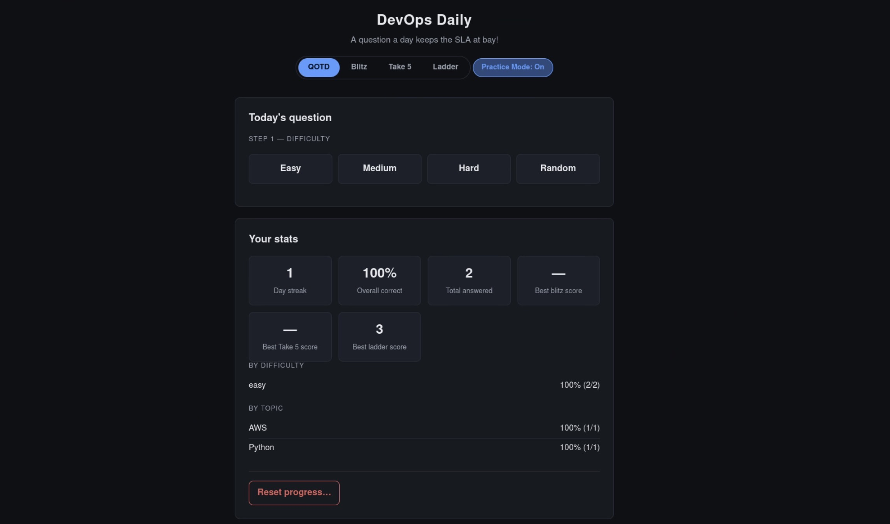
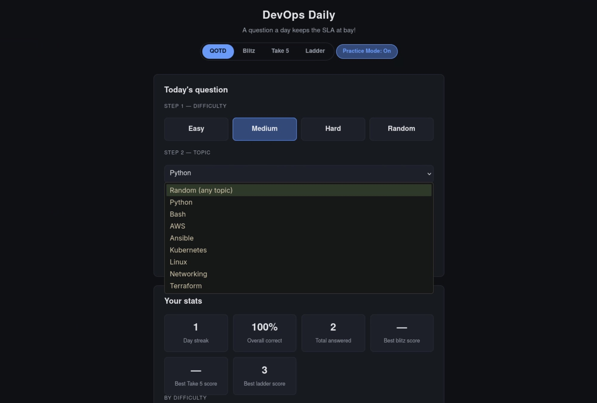
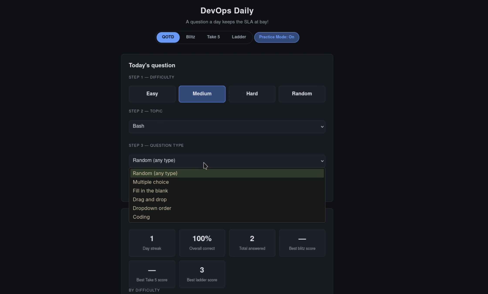

# DevOps Daily



A small FastAPI web app for daily DevOps practice across topics like
Python, Bash, AWS, Ansible, Kubernetes, Linux, Networking, and
Terraform, with per-topic and per-difficulty stats and a day-streak
tracker. Four modes are available, switchable via tabs in the header:

- **QOTD** — one question a day (or unlimited, in practice mode)
- **Blitz** — answer as many questions as you can in 60 seconds
- **Take 5** — five questions, untimed
- **Ladder** — climb easy → medium → hard per subject; one wrong
  answer ends the run

## Setup

**Dependencies** (see `requirements.txt`):

- `fastapi`, `uvicorn` — web server
- `jinja2` — templating
- `anthropic` — LLM grading of free-form coding answers
- `python-dotenv` — loads `.env`

Install into the project's venv:

```bash
python -m venv venv
source venv/bin/activate
pip install -r requirements.txt
```

**Environment variables** — create a `.env` file in the repo root:

```
ANTHROPIC_API_KEY=sk-...
```

This is required for grading `coding`-type questions — free-form
answers that exist across most topics (Bash, Python, Terraform, AWS,
Ansible, Linux, Kubernetes, Networking). `main.py` calls the Anthropic API via `anthropic.Anthropic()` with
model `claude-haiku-4-5` to judge these. All other question types
(mcq, fill-in-blank, drag-and-drop, dropdown-order) are graded locally
without an API call.

**Database**: SQLite, path controlled by the `DB_PATH` env var
(defaults to `devops_daily.db` in the repo root — see `db.py`). The
schema is created automatically on startup.

**Run locally**:

```bash
source venv/bin/activate
uvicorn main:app --reload
```

Then open `http://127.0.0.1:8000`.

**Seed the question bank** (only needed once, or after adding new
content — `seed.py` skips questions it's already inserted):

```bash
python seed.py
```

## Usage

### QOTD vs. Blitz vs. Take 5 vs. Ladder

The header tabs switch between the four modes. QOTD is the
daily-lock flow described below. Blitz (see [Blitz mode](#blitz-mode)),
Take 5 (see [Take 5 mode](#take-5-mode)), and Ladder (see
[Ladder mode](#ladder-mode)) are standalone runs — switching to any of
them never touches the QOTD daily lock, streak, or stats, and vice
versa.

### Daily question flow

On load, the app checks whether you've already answered today (EST).
If not, you're taken through a three-step selection screen:

1. **Difficulty** — Easy / Medium / Hard / Random
2. **Topic** — a specific topic, Random (any topic), or Weakest
   (your lowest-scoring topic — only offered once you have 10+ total
   attempts)
3. **Question type** — mcq, fill-in-blank, drag-and-drop,
   dropdown-order, coding, or Random (any type available for the
   difficulty/topic already chosen)




Answering submits to `/api/answer`, records the attempt, and shows the
correct answer plus an explanation (or LLM feedback, for coding
questions).

### Lock / countdown

Once you've answered, the app locks further questions until the next
calendar day in US Eastern time and shows a live countdown to the
reset. This is derived entirely from the `attempts` table (see
`_todays_attempt` / `_seconds_until_midnight_est` in `main.py`) — there's
no separate "answered today" flag.

### Practice mode

A "Practice Mode" toggle in the header bypasses the daily lock so you
can answer back-to-back without waiting — each answer still gets
recorded normally in `attempts`, so stats and streak logic reflect
practice attempts too.

### Question recycling

Within a given difficulty/topic/type combination, questions are drawn
without repeats — each one is marked seen when you answer it and
excluded from that combination's pool going forward. Once every
question matching the combination you're currently using has been
seen, that specific pool is automatically reset (marked unseen again)
so it keeps cycling instead of running out. Recycling is tracked
per-question via `questions.last_seen_at`, separately from `attempts`,
so it doesn't affect stats or streak history.

### Blitz mode

Pick a difficulty, topic, and question type (same three-step selector
as QOTD, minus the daily lock), then hit **Start Blitz**. A 60-second
timer starts and questions are served one after another — each
answer is graded instantly and the next question loads immediately,
with no result screen in between. When the timer hits zero, you see
your score (count of correct answers) and whether it's a new
personal best.

Blitz is fully isolated from QOTD: answers are graded via
`/api/blitz/check` and never written to the `attempts` table, so they
never affect the daily lock, streak, or topic/difficulty stats. They
also don't mark `questions.last_seen_at`, so a Blitz run can't disturb
QOTD's recycling queue. Within a single run, the client tracks which
question ids it has already seen and excludes them from
`/api/blitz/question` so you don't immediately get repeats; if a
narrow filter combination's pool runs out mid-run, repeats are allowed
rather than ending the run early. Coding questions are excluded from
Blitz since LLM grading latency would eat into the 60 seconds.

Each run's score is recorded in the `blitz_runs` table, and your best
score ever (regardless of which filters you used) is shown as **Best
blitz score** in the stats panel and on the Blitz results screen.

### Take 5 mode

Same three-step selector as QOTD — difficulty, topic, and question
type, including coding — but no daily lock and no timer. You get
exactly 5 questions, one at a time, each with a full result screen
(correct answer, explanation, LLM feedback for coding) and a
**Next question** button before moving on. After the fifth, you see
your score out of 5 and whether it's a new personal best.

Take 5 shares Blitz's isolation model: answers go through
`/api/take5/check` and are never written to `attempts` or
`questions.last_seen_at`, so a run can't affect the daily lock,
streak, topic/difficulty stats, or QOTD's recycling queue. Repeats
within a run are avoided the same way — via a client-tracked
`exclude` list — falling back to allowing a repeat if a narrow filter
combination has fewer than 5 questions. Since there's no clock, coding
questions (LLM-graded) are included, unlike Blitz.

Each run's score is recorded in the `take5_runs` table, and your best
score ever (regardless of which filters you used) is shown as **Best
Take 5 score** in the stats panel and on the Take 5 results screen.

### Ladder mode

Pick one or more subjects (no Random — this is the one mode where a
subject is mandatory) by clicking them in the order you want to play
them; the order is shown as a number on each selected subject. Hit
**Start Ladder** and you're given an **easy** question for the first
subject. Answer correctly and you move to a **medium** question on the
same subject, then **hard**; clear hard and the next subject's easy
question begins. Answer *any* question wrong and the run ends
immediately. Clearing hard on your last subject clears the whole
ladder. There's no difficulty or type picker beyond the subject
list — difficulty is dictated by your position on the ladder, and
question type (including coding, since there's no clock) is always
random.

Your score is the number of questions answered correctly before the
run ended (or before you cleared the whole ladder). Ladder shares the
same isolation model as Blitz/Take 5: `/api/ladder/check` never writes
to `attempts` or `questions.last_seen_at`, and repeats within a run are
avoided via a client-tracked `exclude` list across the whole run (all
subjects), falling back to allowing a repeat if a subject/difficulty
pool is exhausted.

Each run is recorded in the `ladder_runs` table (subjects played, in
order, plus final score), and your best score ever — regardless of how
many subjects you picked — is shown as **Best ladder score** in the
stats panel and on the Ladder results screen.

### Reset progress

The stats panel has a "Reset progress…" control (two-step confirm)
that wipes all rows from `attempts` and clears every question's seen
state, returning the app to a first-run state. It never touches
question content (prompts, answers, explanations).

## Question bank

Questions are pre-written, not generated at runtime. They live as
Python literals in `content/<topic>_<difficulty>.py` (e.g.
`content/python_easy.py`), each tagged with `topic`, `difficulty`, and
`type`. `seed.py` imports all of these batches and inserts any that
aren't already present in the `questions` table (dedup key: topic +
difficulty + type + prompt), so it's safe to re-run after adding new
content files.

## Schema

**`questions`** — the content bank: `topic`, `difficulty`, `type`,
`prompt`, `options` (JSON, for mcq/drag-and-drop/dropdown-order),
`correct_answer`, `explanation_correct`, `explanation_incorrect`, plus
`last_seen_at` (nullable timestamp used only for the recycling queue —
see [Question recycling](#question-recycling)).

**`attempts`** — one row per answered QOTD/practice question:
`question_id` (FK → `questions`), `timestamp`, `topic`, `difficulty`,
`type`, `user_answer`, `correct`, `llm_feedback` (coding questions
only). All QOTD stats, streaks, and the daily lock are computed live
from this table — see `db.py` for the full `CREATE TABLE` statements.
Blitz attempts are never inserted here (see [Blitz mode](#blitz-mode)).

**`blitz_runs`** — one row per completed Blitz run: `timestamp`,
`difficulty`, `topic`, `type` (the filters used), `score` (count of
correct answers), `total` (questions answered). `best_blitz_score` in
`/api/stats` is `MAX(score)` over this table.

**`take5_runs`** — one row per completed Take 5 run: same shape as
`blitz_runs` (`timestamp`, `difficulty`, `topic`, `type`, `score`,
`total` — `total` is always 5). `best_take5_score` in `/api/stats` is
`MAX(score)` over this table.

**`ladder_runs`** — one row per completed Ladder run: `timestamp`,
`topics` (JSON array of subjects, in the order played), `score`
(questions answered correctly). `best_ladder_score` in `/api/stats` is
`MAX(score)` over this table.

## License

MIT.
